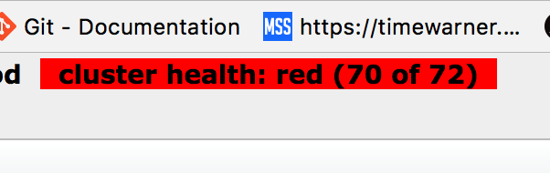

---

## Is Your application health?
###### This one trick will ease all of your support pains.

### Mark Headley 

---

## Warning...

There isn't any code in this preso.

---

## Scenario

---

## ENGAGE TV is down....

---

User calls Tier One support.

---

Tier One --> Tier Two (BA/PM) --> Hunts down the coder.

---

## Triage 

---

## What went wrong?

* New code having problems?
* What errors are the user receiving?
* Is there anything in the error emails?
* Anything in the logs?
* What about the system itself (machines, dns, network, solar alignment, etc...)

---

##Uh, oh... Elastic is down

---

##Result

Not that you personally can do much about this, you need to contact DevOps, DOC, etc.

---

##What If???

Wouldn't it be great if Tier One could have detected this, notified the correct people and you could keep coding?

---

### What to do?

---

How can we figure out, at a glance, that the external items that EngageTV talks to are up and running?

---

### Possible Solution

Create a status page / sanity check / health monitor

---

### Goals

> The result must be simple to understand. (Yes/No)
> Result should give a simple breakdown of the systems involved.

---

### How to Implement?

Determine a way to ping/poll each external system within the application to determine if the application is responding.
Aggregate that information to show whether or not the application is 'healthy'

---

### Thinking...

At the API tier, ETV talks to 3 things
* Mongo
* Elastic
* BackEnd / Updaters

The Updaters (which are a Windows process), talk to other systems to build up the Elastic index
* Titlewave
* Harbor
* ASM
* DataCity
* Spotlight

---

### More Thinking...
##### Mongo

I can execute a command against Mongo and determine based on the results if things are healthy.

(DBStat)

---

### More thinking...
##### Elastic Search

There is a API call on the Elastic drivers that can used.  Since the server itself is up all the time, we want to see the health of the indexes.

---

### More thinking...
##### Updaters (EngageTVs worker process)

The Updater process has a monitoring page.  If that page is responding, then the Updater service is running.

---

### More thinking...
##### Harbor

Harbor has a Ping method. -- One and done.

---

### More thinking...
##### DataCity

DataCity has a ping method, but it returns html.  Again, if I get a response, I am assuming the site is up.

---

### More thinking...
##### Titlewave

Titlewave doesn't have a ping method...yet.  **BUT** I can perform a GET that returns no data.  If Titlewave returns back without exception, we can assume the system is up.

---

### More thinking...
##### ASM

ASM doesn't have a ping method, and probably won't.  Follow Titlewave's example. 

---

### More thinking...
##### Spotlight

*This system will be sunsetted shortly.*

Use the Titlewave thinking...rinse, repeat.

---

### Simple JSON object

	SystemName
	Url
	IsAlive
	Message (used for exceptions)

---

### Time to build

(hacker image)

---

### Build an API endpoint

---

### Build a pretty UI

---

## Demo

---

###Bonus

Since the API endpoint will return a 503 (System Unavailable) vs a 200, DevOps can use the endpoint in their build process to ensure the application was deployed successfully.

---

###Bonus #2

Other *Upstream* environments can use the endpoint in their System checks to see if EngageTV is running correctly.

---

###Final thoughts

PROS:
> Gives us a heads up on the systems that ETV talks with.  We are able to, at a glace, determine if there is an issue and where that issue lies.
> Goal is to cut down on the amount of triaging the system during outages.
> Streamline a process for DevOps' CI process.

CONS:
> The System health mechanism is not made for frequent polling.  Since we are cheating with a couple of the checks to external systems, it is unknown what type of effect calling the external endpoints may impact that system's resources.
> Some of the calls make take a few moments to return.

---

###Lingering Thoughts

Can it be improved?  You betcha!

---

## Questions?

