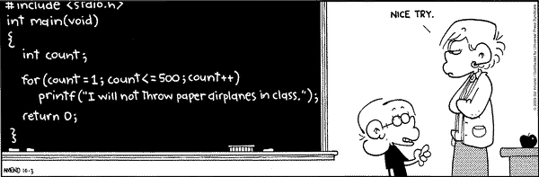

---
## Is Your application healthy?
###### This one trick will ease all of your support pains.


### Mark Headley

---
# Warning...

There isn't any code in this preso.

---
## ...and fair warning


---
# Scenario

---
## Application is down....


---
### User calls Tier One support.


---
### Tier One hands it over to Tier Two (BA/PM) 


---
### Tier Two ... find a developer


---
# Triage 
---
## What went wrong?

- New code having problems? |
- What errors are the user receiving? |
- Is there anything in the error emails? |
- Anything in the logs? |
- What about the systems themselves (machines, dns, network, solar alignment, etc...) |

---
#Ah-ha!

Elastic is causing the outage... 


---
##What to do?

- Not much you personally can do about this... | 
- You need to contact DevOps, DOC, NOC, DOC OCK, SPOCK... |

---
#What If???

- Tier One could have determined this issue when they received the call, then notified the correct people?  |

---
##...and you could keep coding?


---
#Imma programmer!


---
##Goals

- Need to determine, at a glance, that the external systems that talks to app are up and running? |
- The result must be simple to understand. (Yes/No) |
- Result should give a simple breakdown of the systems involved. |

---
##What to do?

- Determine a way to check each external system within the application to see if it is responding. |
- Aggregate that information to show whether or not the application is 'healthy' |

---
##Easy, right?

- Let's go to a pratical example... |
- I am partially biased, so we will use EngageTV... |

--- 
#Thinking
---
##...okay, okay..."Analysis"


---
##How are the external systems in ETV organized?

- Mongo |
- Elastic |
- Updaters |
	- Titlewave |
	- Harbor |
	- ASM |
	- DataCity |
	- Spotlight |

---
# How do I get what I want? 
--- 
##Mongo


- A raw command can be executed against Mongo to determine the state of the system based on the results. |

---
##Elastic Search


- Similar to Mongo, there is a call on the Elastic API drivers that can be used.  It returns info on the state of the cluster.  We can use that info to determine the state of the system. |

---
##Updaters (EngageTVs worker process)


- The Updater process has a monitoring page.  If that page is responding, then the Updater service is running. |

---
##Harbor


- Harbor has a Ping method. -- One and done. |

---
##DataCity


- DataCity has a ping method, but it returns html.  If a 200 response is returned, then assume the site is up. |

---
##Titlewave


- Titlewave doesn't have a ping method...yet. |
- I can perform a GET that returns no data.  If Titlewave returns back without exception, we can assume the system is up. |

---
##Application Security Manager (ASM)


- ASM doesn't have a ping method, and probably won't.  Follow Titlewave's example. |

---
##Spotlight


- Use the Titlewave thinking...rinse, repeat. |
*This system will be sunsetted shortly.*

---
##Putting the pieces together

Simple JSON object
```
	SystemName
	Url
	IsAlive
	Message (used for exceptions)
```

- Put together an API endpoint |
- Put together a pretty UI |

---

##Time to build


---
#Demo
---
##Bonus

Other *Upstream* environments can use the endpoint in their System checks to see if the application is running correctly.

---
##Bonus #2

Since the API endpoint will return a 503 (System Unavailable) if there is an issue, and a 200 otherwise; DevOps can use the endpoint in their build process to ensure the application was deployed successfully.


---
#Final thoughts

---
## PROS:
- Gives us a quick status of external systems used within our app.  |
- Putting this into a UI, at a glace it can be determined if there is an issue and where that issue lies. |
- Goal is to cut down on the amount of time it takes to triage why the system is down. |
- Streamline a process for DevOps' CI process. |

---
## CONS:
- This is not made for frequent polling.  Since we are cheating with a couple of the checks to external systems, it is unknown what type of effect calling the external endpoints may impact that system's resources. |
- Some of the calls may take a few moments to return. |

---
##Lingering Thoughts

- Can it be improved?  You betcha!

---
# Questions?


